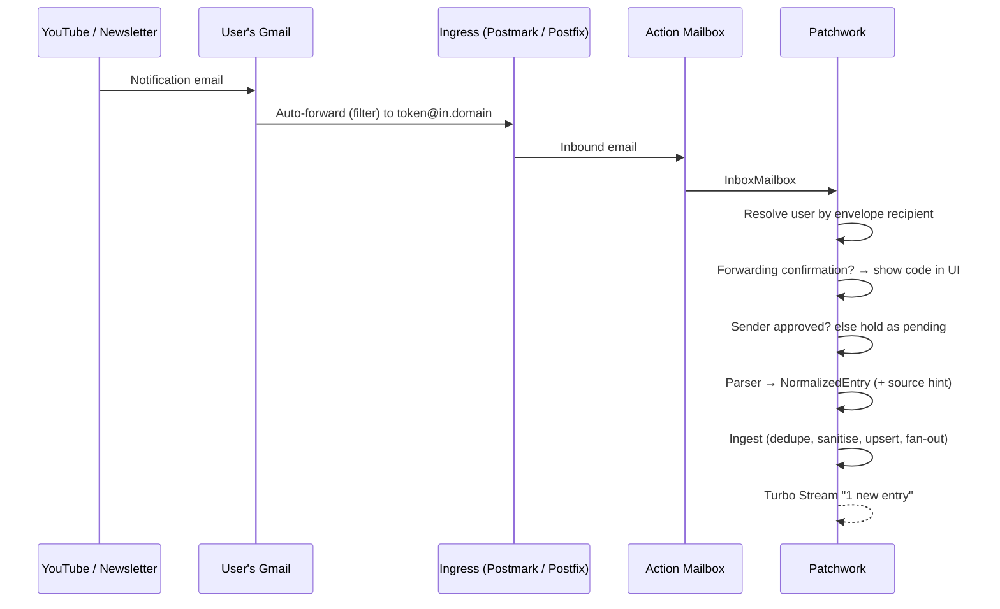
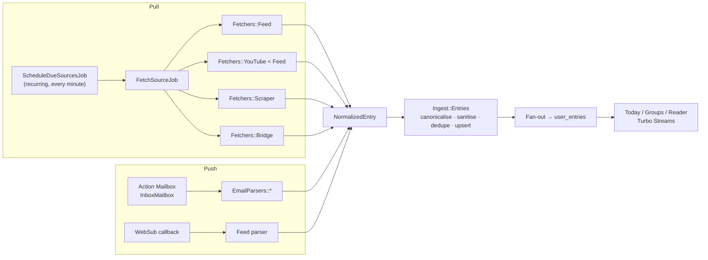

# Patchwork — Technical Requirements

**Status:** Draft v0.1 · 2026-09-11
**Stack:** Rails 8.1 · Ruby 3.2 · SQLite · Hotwire (Turbo + Stimulus) · Solid Queue / Cache / Cable · Action Mailbox · Kamal

---

## 1. Summary

Patchwork is a personal news reader. It gathers updates from sources the user picks (blogs, YouTube channels, Medium authors, newsletters, websites without feeds) into a single, organised news feed.

A classic RSS reader only understands RSS. Patchwork treats RSS as one of several **fetch strategies**. Each source is fetched with the method that works best for it:

| Strategy | How it works | Typical sources |
|---|---|---|
| **Feed polling** | Periodically download RSS / Atom / JSON Feed | Blogs, YouTube, Medium, Substack, Reddit, podcasts |
| **Push (WebSub)** | The publisher's hub calls us when there is new content | YouTube, many WordPress/Blogger sites |
| **Email ingestion** | The user forwards or subscribes with a personal Patchwork address | Newsletters, email-only alerts, notification emails |
| **Scraping** | Download a page and extract items with selectors, or detect changes | Sites with no feed and no email option |
| **Bridge** | Use a self-hosted RSSHub / RSS-Bridge to turn a site into a feed | Telegram channels, sites without feeds that a bridge already supports |

The same pipeline normalises output from every strategy, so all entries look the same in the UI no matter where they came from.

---

## 2. Review of the idea

### What's strong

- **One normalised feed from many transports.** This is the right core abstraction, and a real gap: most readers stop at RSS, and most newsletter tools stop at email.
- **Email ingestion.** A good early feature. It covers a large class of content RSS can't reach, and Rails ships with Action Mailbox, which makes it cheap to build.
- **Groups and a daily view.** These are what make a reader pleasant to use, rather than just a pile of items.

### Recommended adjustments

1. **The fetch strategy belongs to the source. The features belong to the account.**
   The user shouldn't have to pick "how to fetch". They paste a URL and Patchwork works out the best strategy automatically (see §5.2). Per-account **integrations** are the things that need setup or carry cost: the personal email inbox, scraping, a bridge instance URL, an API key. They are switched on or off per account (see §5.9).

2. **Many "non-RSS" sites actually have feeds.** Check before scraping or using email:

   | Site | Feed |
   |---|---|
   | YouTube channel | `https://www.youtube.com/feeds/videos.xml?channel_id=UC…` (latest 15 videos) |
   | YouTube playlist | `https://www.youtube.com/feeds/videos.xml?playlist_id=PL…` |
   | Medium author | `https://medium.com/feed/@username` |
   | Medium publication / tag | `https://medium.com/feed/<publication>` · `https://medium.com/feed/tag/<tag>` |
   | Substack | `https://<name>.substack.com/feed` |
   | Reddit | `https://www.reddit.com/r/<sub>/.rss` |
   | Most blogs | `<link rel="alternate" type="application/rss+xml">` in the page HTML |

3. **For YouTube, email is a worse path than RSS.** The bell → email → Patchwork flow works, but:
   - YouTube email notifications are **not guaranteed** for every upload. They can be delayed, batched, or skipped.
   - The emails go to the user's Google address, so the user must set up a **Gmail forwarding filter**. Gmail first sends a confirmation code to the forwarding address, and Patchwork has to show that code in its UI (see §5.5.3).
   - The channel's RSS feed needs no setup, and WebSub push gets new videos within minutes.

   **Recommendation:** Build email ingestion as planned, because it's the only way to get **newsletters and email-only content**. For YouTube, use the RSS feed as the default. Still support YouTube notification emails, and merge them with the RSS items (dedup by video ID) so the same video never shows up twice.

4. **Fetch each shared source once.** If 50 users follow the same YouTube channel, download it once and fan the entries out to all 50. Email sources are the exception: they are always private to one user.

5. **Scraping is a last resort.** It's fragile, it may break the site's terms of service, and it costs more to run. Prefer, in order: native feed → WebSub → bridge (RSSHub / RSS-Bridge) → email → scraping.

6. **Build the core reader with RSS before email.** Email-ingested entries need somewhere to appear: sources, entries, groups, read state. A generic RSS fetcher (Feedjira, about a day of work) is the simplest way to exercise that pipeline, and it covers YouTube and Medium immediately. Email ingestion then becomes the first **integration** (Milestone 2).

---

## 3. Glossary

| Term | Meaning |
|---|---|
| **Source** | Something that produces entries: a feed URL, a YouTube channel, an email sender, a scraped page. Can be shared between users or private to one user. |
| **Subscription** | Links a user to a source. Holds the user's custom title, group, and mute setting. |
| **Entry** | One news item (article, video, newsletter issue), normalised. Belongs to a source. |
| **User entry** | A user's state for one entry: read, starred, hidden. |
| **Group** | A user-defined folder of subscriptions, e.g. "Tech", "Friends' blogs". |
| **Fetcher** | An adapter that implements one fetch strategy (`Fetchers::Feed`, `Fetchers::Scraper`, …). |
| **Email parser** | An adapter that turns one kind of inbound email into entries (`EmailParsers::Generic`, `EmailParsers::YouTube`). |
| **Integration** | A per-account feature that must be enabled and configured (email inbox, scraping, bridge, WebSub). |
| **Inbox address** | The user's personal, secret inbound email address, e.g. `k3j9x2m8q4ab@in.patchwork.app`. |

---

## 4. Scope

### In scope (MVP: milestones 0–2)
- Accounts: sign up, log in, time zone
- Adding sources by URL, with automatic discovery (RSS/Atom/JSON Feed, YouTube, Medium, blog autodiscovery)
- Groups, the Today view, All unread, per-group and per-source views, starred entries
- Read and star state, "mark all as read"
- OPML import and export
- Email ingestion: personal inbox address, Gmail forwarding confirmation, sender approval, generic and YouTube email parsers

### Later
- WebSub push, RSSHub / RSS-Bridge integration, scraping wizard, headless browser
- Full-text search, daily digest email, PWA / offline, image proxy
- AI features (summaries, cross-source deduplication of the same story)

### Out of scope
- Closed social networks (Instagram, Facebook, LinkedIn, X) as first-class sources. APIs are closed or expensive, and scraping them breaks their terms of service. They may become reachable later through bridges, on a best-effort basis.
- Republishing content publicly. Patchwork is for personal reading only.
- Reading the user's mailbox through the Gmail API or IMAP (see §5.5.8).

---

## 5. Functional requirements

### 5.1 Accounts

- **FR-1.1** Sign up, log in and log out with email and password. Use the Rails 8 authentication generator (`bin/rails g authentication`) and add a registration flow, which the generator doesn't include.
- **FR-1.2** Password reset by email.
- **FR-1.3** User settings: time zone (used for "Today"), "mark as read on open" or "on scroll", default view.
- **FR-1.4** Each user gets a unique inbox address when the Email integration is enabled (§5.5).
- **FR-1.5** Account deletion removes all private data: subscriptions, user entries, private sources, and stored emails.

### 5.2 Adding sources (discovery)

- **FR-2.1** The user pastes any URL, or a YouTube `@handle`. `SourceResolver` returns one or more **candidates**, each with a strategy, a title, and a preview of recent items.
- **FR-2.2** The resolver tries these steps in order and collects every candidate it finds:
  1. **Specialised resolvers** matched by host: YouTube, Medium, Substack, Reddit.
  2. **The URL is itself a feed.** Check the content type, or try parsing it with Feedjira.
  3. **HTML autodiscovery:** `<link rel="alternate" type="application/rss+xml | application/atom+xml | application/feed+json">`.
  4. **Common feed paths:** `/feed`, `/rss`, `/rss.xml`, `/atom.xml`, `/index.xml`, `/feed.xml`.
  5. **Bridge route**, if the bridge integration is enabled.
  6. **Scraping wizard**, if the scraping integration is enabled.
  7. **Fallback:** "This site has no feed. Subscribe to its newsletter with your Patchwork address: `…`"
- **FR-2.3** Before confirming, the user sees a preview of the last 5 items, and can set a custom title and a group.
- **FR-2.4** Resolved source URLs are canonicalised: lowercase scheme and host, default port and fragment removed, tracking query parameters (`utm_*`, `fbclid`, …) removed. Trailing slashes are kept, because servers may treat `/feed` and `/feed/` differently. If a shared source with the same canonical URL already exists, it is reused.
- **FR-2.5** A user can't subscribe to the same source twice.

### 5.3 Groups

- **FR-3.1** CRUD for groups, plus drag-and-drop ordering.
- **FR-3.2** A subscription belongs to zero or one group. Ungrouped subscriptions appear under "Other".
- **FR-3.3** The sidebar shows each group and source with its unread count.

### 5.4 Reading experience

- **FR-4.1 Today view** (the default page): unread entries published in the last 24 hours in the user's time zone. They are grouped by group, then by source, newest first.
- **FR-4.2 Other views:** All unread, Group, Source, Starred, and "All" (including read entries).
- **FR-4.3** Entry list shows: source icon and title, entry title, excerpt, thumbnail, relative time.
- **FR-4.4 Reader view:** sanitised full content, "Open original", star, and mark unread. YouTube entries use an embedded player from `youtube-nocookie.com`.
- **FR-4.5** Mark as read: on open, or on scroll (configurable). "Mark all as read" works for the current view, with an "older than X" option.
- **FR-4.6** Keyboard shortcuts: `j`/`k` next/previous, `o` open, `s` star, `m` toggle read, `v` open original, `Shift+A` mark all read.
- **FR-4.7** New entries appear live through Turbo Streams over Solid Cable, shown as an "N new entries" pill, not injected directly into the list.
- **FR-4.8** Mute a subscription: its entries are hidden from Today and All unread but kept in the source view.
- **FR-4.9** Responsive layout that works at phone width.

### 5.5 Email ingestion (first integration)

#### 5.5.1 Inbox address
- **FR-5.1** When the user enables the Email integration, they get an address `<token>@in.<domain>`. The token is 12+ random base32 characters.
- **FR-5.2** The user can **rotate** the token. The old address stops working immediately, and the UI warns that forwarding rules and newsletter subscriptions will need updating.
- **FR-5.3** The settings page shows copy-paste setup guides for:
  - subscribing to a newsletter directly with the Patchwork address (preferred: no forwarding needed),
  - a Gmail filter that auto-forwards specific senders (e.g. `from:noreply@youtube.com`),
  - Outlook and other providers' forwarding rules.

#### 5.5.2 Ingress
- **FR-5.4** Use **Action Mailbox**. The ingress is configurable; see Open question 2. Candidates: Postmark or Mailgun inbound webhooks (hosted, simplest), or the `relay` ingress with Postfix as a Kamal accessory (self-hosted).
- **FR-5.5** DNS: an MX record for the `in.<domain>` subdomain, kept separate from any outbound mail domain.
- **FR-5.6** Routing uses the **envelope recipient** (`X-Original-To` / `Delivered-To` / the ingress's recipient field), not the `To:` header. A forwarded email's `To:` still shows the user's Gmail address. Mail for unknown tokens is bounced.

#### 5.5.3 Forwarding confirmation
- **FR-5.7** Emails from `forwarding-noreply@google.com` (and equivalents for other providers) are detected as forwarding confirmations. Patchwork stores them and shows the **confirmation code and link** prominently in the UI, so the user can finish the Gmail setup without leaving the app.
- **FR-5.8** Patchwork never clicks confirmation links automatically. The user confirms.

#### 5.5.4 Sender identification and approval
- **FR-5.9** The **sender key** is `List-Id` if present, otherwise the original `From:` address. Gmail auto-forwarding keeps the original `From:`.
- **FR-5.10** Sender statuses:
  - **approved**: create entries straight away,
  - **pending** (unknown sender): hold the email and show it in an "Inbox requests" list,
  - **blocked**: drop silently.

  Approving a pending sender creates a private `email` source and a subscription, then processes the held emails.
- **FR-5.11** Setting: "Auto-approve new senders" (default **off**).
- **FR-5.12** A parser can return a **source hint** that overrides sender-based mapping. For example, every YouTube notification comes from `noreply@youtube.com`, but each one belongs to a different channel. The YouTube parser maps each email to that channel's shared `youtube` source.

#### 5.5.5 Parsing
- **FR-5.13** A parser registry matches a parser to each email by sender and headers. `EmailParsers::Generic` is the fallback.
- **FR-5.14** Generic parser:
  - `title` = subject
  - `content` = sanitised HTML body (text body converted to HTML if there's no HTML part)
  - `url` = the "View in browser" link if one can be detected; otherwise the entry has no external link and opens in the reader
  - `published_at` = the `Date:` header
  - `guid` = `Message-ID`
  - `author` = the sender's display name
- **FR-5.15** YouTube parser: extract the video ID(s), canonical `https://www.youtube.com/watch?v=<id>`, video title, channel name/ID, and thumbnail (`https://i.ytimg.com/vi/<id>/hqdefault.jpg`). The entry `guid` is `yt:video:<id>`, the same as in YouTube RSS, so the two deduplicate naturally.
- **FR-5.16** Known redirect wrappers (e.g. `youtube.com/attribution_link`, `google.com/url?q=`) are unwrapped offline by decoding the query parameter. **Patchwork never fetches links found in emails.** They may be unsubscribe, confirm, or tracking actions.
- **FR-5.17** Save the `List-Unsubscribe` (and `List-Unsubscribe-Post`) headers on the source. The source settings show an **Unsubscribe** button, using RFC 8058 one-click POST when supported, otherwise the mailto/URL.

#### 5.5.6 Limits and retention
- **FR-5.18** Maximum message size is 10 MB. Attachments are ignored, except inline images referenced by the HTML body. Default rate limit: 500 emails per user per day.
- **FR-5.19** Raw emails are incinerated after 30 days (Action Mailbox default). Entries follow the normal retention policy (§7.5).
- **FR-5.20** Store the `Authentication-Results` header. The YouTube parser only accepts emails with `dkim=pass` for `youtube.com`. DKIM survives forwarding; SPF does not.

#### 5.5.7 Email flow



#### 5.5.8 Alternatives considered
- **Gmail API with OAuth.** Rejected for now. Reading mail needs a restricted scope, which requires a paid Google security assessment for public apps.
- **IMAP polling with an app password.** Possible later for self-hosters. Storing mailbox credentials is a large security liability and would give Patchwork access to all of the user's mail.

### 5.6 Feed polling (RSS / Atom / JSON Feed)

- **FR-6.1** Parse feeds with Feedjira. Support RSS 0.9x/2.0, Atom 1.0, and JSON Feed 1.x.
- **FR-6.2** Conditional requests with `ETag` / `If-Modified-Since`. A `304` response counts as a successful fetch with no new items.
- **FR-6.3** Entry guid: the feed's `id`/`guid` if present, otherwise the canonical URL, otherwise a hash of title + published date.
- **FR-6.4** Relative links and image URLs in content are resolved against the entry URL.
- **FR-6.5** Handle permanent redirects (`301`/`308`) by updating the source URL. Handle `410 Gone` by pausing the source and notifying subscribers.

### 5.7 YouTube

- **FR-7.1** Accepted input: `/channel/UC…`, `/@handle`, bare `@handle`, `/c/<name>`, `/user/<name>`, a video URL (resolves to its channel), and a playlist URL (resolves to the playlist feed).
- **FR-7.2** Resolve to a `channel_id` by fetching the page and reading the RSS alternate link or canonical URL. The YouTube Data API is optional and needs a key plus a 10k units/day quota (Open question 7).
- **FR-7.3** A YouTube source is a feed source with extra metadata: video ID, thumbnail, and duration when known.
- **FR-7.4** Per-subscription option: hide Shorts (detection method to be decided during implementation).
- **FR-7.5** Later: WebSub push through `https://pubsubhubbub.appspot.com` (§5.10).

### 5.8 Scraping (later, integration-gated)

- **FR-8.1** Wizard: the user enters a list-page URL. Patchwork shows the rendered page and asks for CSS selectors: item, title, link, date (optional), content (optional). There's a live preview of the extracted items.
- **FR-8.2** "Change detection" mode: watch one page region, and create an entry "Page changed" with a text diff whenever its hash changes.
- **FR-8.3** Plain HTTP + Nokogiri by default. A headless browser (Ferrum + Chrome) only when the user explicitly enables "JavaScript rendering", on a separate low-concurrency queue.
- **FR-8.4** Minimum interval is 1 hour. Respect `robots.txt`, and send a descriptive `User-Agent` with a contact URL.
- **FR-8.5** When selectors match 0 items for 3 consecutive fetches, the source goes to `error` and the user is asked to fix the selectors.

### 5.9 Integrations (per-account features)

| Integration | MVP | Settings | Notes |
|---|---|---|---|
| **Email inbox** | ✅ | token, auto-approve senders | Milestone 2 |
| **WebSub push** | — | — | Enabled globally once built; no user setup |
| **Bridge (RSSHub / RSS-Bridge)** | — | instance URL | Adds bridge routes to discovery |
| **Scraping** | — | allow JS rendering | Gated because it costs more and has ToS implications |
| **YouTube Data API** | — | API key (encrypted) | Better channel resolution and metadata |

- **FR-9.1** An integrations settings page lists each integration with an enable toggle and its settings form.
- **FR-9.2** Secrets in integration settings are stored with Active Record Encryption.
- **FR-9.3** Disabling an integration pauses its sources but doesn't delete them. Re-enabling resumes them.
- **FR-9.4** Global, admin-controlled feature flags decide which integrations are offered at all. A simple `Feature` table is enough at first; adopt Flipper if staged rollouts are needed.

### 5.10 Push via WebSub (later)

- **FR-10.1** When a feed advertises `<link rel="hub">`, subscribe to the hub with a public HTTPS callback `/websub/:source_token`.
- **FR-10.2** Verify the hub challenge, check the `X-Hub-Signature` HMAC, and renew leases before they expire.
- **FR-10.3** Pushed payloads go through the same feed parser and ingest. Polling continues at a long interval (e.g. 12h) as a safety net.

### 5.11 OPML

- **FR-11.1** Import OPML: create sources, subscriptions, and groups from outline folders. Show a summary of added, skipped and failed feeds.
- **FR-11.2** Export OPML of all feed-type subscriptions. Email and scraped sources are listed in a comment, since OPML can't represent them.

---

## 6. Architecture

### 6.1 Pipeline



### 6.2 Adapter interfaces (sketch)

```ruby
# Value object every strategy produces.
NormalizedEntry = Data.define(
  :guid, :url, :title, :author, :summary, :content_html,
  :image_url, :published_at, :media, :source_hint
)

module Fetchers
  class Base
    # Called by SourceResolver during discovery.
    def self.resolve(url) = [] # => [SourceCandidate]

    def initialize(source) = @source = source

    # => FetchResult(entries: [NormalizedEntry], etag:, last_modified:, not_modified: bool)
    def fetch = raise NotImplementedError
  end
end

module EmailParsers
  class Base
    def self.match?(mail) = false
    def initialize(mail) = @mail = mail
    def entries = raise NotImplementedError # => [NormalizedEntry]
  end
end
```

All outbound HTTP goes through one client, `Http::SafeClient` (§7.1). Fetchers never call `Net::HTTP` directly.

### 6.3 Scheduling

- **Recurring job** (`config/recurring.yml`): `ScheduleDueSourcesJob` runs every minute. It selects active sources with `next_fetch_at <= now` and enqueues `FetchSourceJob`.
- **Concurrency:** `limits_concurrency` keyed by source ID (never fetch one source twice at once) and by host (at most 2 concurrent requests per host).
- **Adaptive interval:** start at 1h, with bounds of 15 min to 24h. Halve it when new items arrive and grow it ×1.5 when none do. Honour `Cache-Control: max-age`, `Retry-After`, and RSS `<ttl>` as lower bounds.
- **Errors:** exponential backoff. After 10 consecutive failures the source becomes `error` and pauses, and subscribers see a warning badge with the last error message.
- **Queues:** `fetch` (feeds), `ingest`, `mail`, `scrape_js` (low concurrency), `default`.

### 6.4 Data model

```
users
  email_address, password_digest, time_zone, settings (json)

sessions                       (Rails auth generator)

sources
  kind            enum: feed | youtube | email | scrape | bridge
  visibility      enum: shared | private
  owner_id        → users (private sources only)
  url             canonical; unique among shared sources
  site_url, title, description, icon_url
  config          json (selectors, channel_id, List-Id, list_unsubscribe…)
  status          enum: active | paused | error
  etag, last_modified
  last_fetched_at, next_fetch_at, fetch_interval
  error_count, last_error
  websub_hub, websub_secret, websub_expires_at

subscriptions
  user_id, source_id, group_id (nullable)
  custom_title, muted (bool), position
  unique (user_id, source_id)

groups
  user_id, name, position

entries
  source_id, guid, url, title, author, summary
  content_html (sanitised), image_url, media (json)
  published_at, fingerprint
  unique (source_id, guid); index (source_id, published_at)

user_entries                   fan-out on write
  user_id, entry_id, subscription_id
  published_at (denormalised for sorting)
  read_at, starred_at, hidden_at
  unique (user_id, entry_id)
  index (user_id, read_at, published_at)

integrations
  user_id, kind (email_inbox | scraping | bridge | youtube_api)
  enabled, settings (json, encrypted)
  unique (user_id, kind)

inbox_addresses
  user_id, token (unique), rotated_at

email_senders
  user_id, key (List-Id or address), display_name
  status enum: pending | approved | blocked
  source_id (after approval)

forwarding_confirmations
  user_id, provider, code, confirm_url, received_at, dismissed_at

fetch_logs                     30-day retention
  source_id, started_at, duration_ms, status, http_status
  new_entries_count, error

action_mailbox_inbound_emails  (Rails)
```

**Why fan-out on write:** a user entry row is created for each subscriber when an entry is ingested, using batched `insert_all`. That keeps Today, group and unread-count queries simple indexed lookups on a single table. At personal-to-small-multi-user scale the extra rows are cheap. If a source ever has thousands of subscribers, switch those sources to lazy state (only store rows for read or starred entries).

### 6.5 Normalisation and deduplication

- Canonicalise URLs: lowercase host, drop default ports and fragments, and strip `utm_*`, `fbclid`, `gclid`, `ref`, and similar parameters.
- Deduplicate **within a source** with the unique index on `(source_id, guid)`, upserting on conflict so edited entries are updated.
- Deduplicate **across strategies for the same user**: `fingerprint` = normalised canonical URL (e.g. `yt:video:<id>`). When a user would get two user entries with the same fingerprint (e.g. YouTube RSS + YouTube email), keep the earliest and link the other.
- `published_at` is clamped to the ingest time if it's in the future. Missing dates fall back to the ingest time.

---

## 7. Non-functional requirements

### 7.1 Security
- **SSRF protection.** Every outbound fetch uses a user-supplied URL, so it goes through `Http::SafeClient`, built on the `ssrf_filter` gem or equivalent. The client:
  - allows only `http`/`https`,
  - resolves DNS and blocks private, loopback, link-local, and cloud-metadata ranges (IPv4 and IPv6),
  - re-checks every redirect hop, with at most 5 redirects,
  - uses a 5s connect and 15s read timeout,
  - caps the response body at 5 MB.
- **HTML sanitisation.** All entry content goes through an allowlist sanitiser (`Rails::HTML5::SafeListSanitizer` plus custom rules):
  - no scripts, styles, forms, or event handlers,
  - iframes only from an allowlist (`youtube-nocookie.com`),
  - links get `rel="noopener noreferrer nofollow" target="_blank"`,
  - 1×1 tracking pixels and known tracker domains are removed.
- **Tracking.** Remote images load with `referrerpolicy="no-referrer"`. An **image proxy** comes later, so newsletter senders can't use images as read receipts or learn the user's IP.
- **Content Security Policy** enabled: no inline scripts in rendered content.
- **Authorisation.** Every query is scoped through `Current.user`. Private sources, and their entries, are never visible to other users.
- **Inbox tokens** are secret, unguessable and rotatable, with per-user rate limits (§5.5.6).
- **Encryption.** Integration secrets use Active Record Encryption.
- **Tooling.** Keep Brakeman and bundler-audit in CI (already set up by `rails new`).

### 7.2 Performance
Reference load: 300 subscriptions and 20k unread entries per user, 50 users on a single server.
- Today and group views: p95 under 300 ms server time, paginated (50 per page, cursor-based).
- Sidebar unread counts come from a cached counter per subscription, refreshed after ingest and after read actions.
- Fetch throughput: at least 2,000 source fetches per hour on one 2-vCPU server.

### 7.3 Reliability
- Ingest is idempotent (unique indexes + upserts), so a retried job is always safe.
- Jobs retry with exponential backoff. Poison jobs are visible in Mission Control – Jobs.
- Source health (last fetch, last error, next fetch) is shown on the source settings page.

### 7.4 Database
SQLite in production is viable with Rails 8's defaults (WAL mode, Solid Queue/Cache/Cable in separate databases). Revisit PostgreSQL if write contention appears, or if full-text search needs outgrow SQLite FTS5. See Open question 3.

### 7.5 Data retention
- Read, unstarred entries older than 90 days are deleted (configurable per user). Starred entries are kept forever.
- Shared entries with no remaining user entries are deleted.
- Fetch logs: 30 days. Raw inbound emails: 30 days.

### 7.6 Observability
- `mission_control-jobs` for the queue dashboard, admin-only.
- Structured logs with `source_id`, `user_id`, and `job_id` tags.
- Error tracking service (Open question 8).

### 7.7 Legal and ethics
- Personal use only: no public republishing of fetched content.
- Scraping respects `robots.txt` and site terms, and uses a descriptive User-Agent with a contact URL.
- Privacy policy covering email content storage and retention.

### 7.8 Testing
- Minitest + fixtures (the Rails default).
- HTTP recorded with WebMock (+ VCR cassettes for real-world feeds: YouTube, Medium, Substack).
- Email tests with Action Mailbox test helpers and `.eml` fixtures:
  - YouTube notification,
  - Gmail forwarding confirmation,
  - a generic newsletter with `List-Id` / `List-Unsubscribe`,
  - an unknown sender,
  - a spoofed YouTube email with no DKIM.
- System tests (Capybara) for: sign up → add source → read in Today; enable email → approve sender → entry appears.
- Unit tests for URL canonicalisation, the sanitiser, and SSRF blocking.

### 7.9 Accessibility
- Semantic HTML, fully keyboard navigable, visible focus states, WCAG AA contrast.

---

## 8. Dependencies

| Gem | Purpose |
|---|---|
| `feedjira` | RSS / Atom / JSON Feed parsing |
| `ssrf_filter` | SSRF-safe outbound HTTP |
| `nokogiri` | HTML parsing: autodiscovery, scraping, email bodies (already a Rails dependency) |
| `addressable` | URL parsing and canonicalisation |
| `pagy` | Pagination |
| `mission_control-jobs` | Solid Queue dashboard |
| `webmock`, `vcr` | HTTP stubbing in tests |
| `ferrum` | Headless Chrome for JS scraping (later) |
| `flipper` | Feature flags, only if needed (§5.9) |

Built into Rails: Action Mailbox, Active Storage (raw email storage), Active Record Encryption, Solid Queue/Cache/Cable, Turbo, Stimulus.

---

## 9. Implementation phases

Each phase ends with something you can run and use locally.

| Phase | Name | Goal |
|---|---|---|
| **1** | Foundation + core feed reader | Sign up, add feeds (including YouTube, Medium), read them in Today / groups |
| **2** | Email inbox | Newsletters and notification emails show up as entries |
| **3** | Polish | Pleasant daily use: shortcuts, live updates, search, retention, PWA |
| **4** | Advanced fetching | WebSub push, bridges, scraping |
| **5** | Smart features | Summaries, story clustering, suggestions |

### Phase 1 — Foundation + core feed reader

**Included**

| Area | Requirements |
|---|---|
| Accounts | FR-1.1 (sign up / log in / log out), FR-1.2 (password reset), FR-1.3 (time zone only; detected at sign-up) |
| Discovery | FR-2.1 – FR-2.5: direct feed, HTML autodiscovery, common paths; YouTube, Medium, Substack and Reddit resolvers; preview before subscribing |
| Groups | FR-3.1 (CRUD, alphabetical order), FR-3.2, FR-3.3 (sidebar unread counts) |
| Reading | FR-4.1 Today, FR-4.2 views, FR-4.3 list, FR-4.4 reader view (YouTube embed), FR-4.5 mark read on open + mark all read, FR-4.8 mute, FR-4.9 responsive |
| Feeds | FR-6.1 – FR-6.5 (Feedjira, conditional GET, guid rules, absolute URLs, redirects / 410) |
| YouTube | FR-7.1 – FR-7.3 (channel / handle / video / playlist URLs → RSS feed) |
| OPML | FR-11.1 import, FR-11.2 export |
| Architecture | §6.1 pull pipeline, §6.2 fetcher interface, §6.3 scheduler (adaptive interval, backoff, auto-pause), §6.4 tables for users, sources, subscriptions, groups, entries, user_entries, fetch_logs |
| Security | SSRF-safe client, allowlist sanitiser (iframes stripped from content), CSP, per-user scoping |
| Ops | Solid Queue runs inside Puma in development, so `bin/dev` is the only process to start |

**Deferred from Phase 1**
- Group drag-and-drop ordering, mark-read-on-scroll setting (→ Phase 3)
- Keyboard shortcuts, live Turbo Stream updates (→ Phase 3)
- Cross-strategy dedup by fingerprint (the column exists; used in Phase 2)
- Per-host concurrency limit (→ Phase 4, when scraping arrives)
- Hide YouTube Shorts FR-7.4 (→ Phase 3)

**Exit criteria:** a new user can sign up, add a blog, a YouTube channel and a Medium author by pasting URLs, organise them into groups, see new items appear on Today without manual refresh of the source, read / star / mark all read, and import an OPML file from another reader.

**Status: implemented (2026-09-11).** Implementation notes:
- Time zones are stored as the browser's IANA name (e.g. `Europe/Kyiv`) or a Rails zone name. Unknown values fall back to UTC.
- The `json` gem is pinned to 2.x. json 3.0 no longer accepts the positional options hash that ActiveSupport 8.1.3's `JSON.decode` passes, which breaks every JSON column. Remove the pin once Rails supports json 3.
- Feedjira parses feeds that mention "feedburner" with its FeedBurner parser, which ignores the channel image and `<ttl>`. Those feeds get a letter avatar and the default interval.

### Phase 2 — Email inbox
Action Mailbox + ingress + MX; inbox address and rotation; Gmail forwarding-confirmation UI; sender approval; generic and YouTube parsers; YouTube email ↔ RSS dedup via fingerprint; List-Unsubscribe; the integrations settings page (§5.9) with the Email integration.

### Phase 3 — Polish
Keyboard shortcuts, live updates, search (FTS5), retention jobs, source health UI, group ordering, hide Shorts, PWA manifest, daily digest email.

### Phase 4 — Advanced fetching
WebSub push, bridge integration (RSSHub / RSS-Bridge), scraping wizard, change detection, headless rendering, per-host concurrency limits.

### Phase 5 — Smart features
Summaries, cross-source story clustering, "you might like" suggestions.

---

## 10. Open questions

1. **Audience:** is Patchwork a personal / self-hosted app, or a public multi-user service? This affects sign-up (open or invite-only), abuse controls, cost limits, and the choice of email ingress.
2. **Inbound email:** which domain, and which ingress: Postmark, Mailgun, SendGrid, or a self-hosted Postfix relay?
3. **Database:** stay on SQLite in production (recommended to start), or move to PostgreSQL now?
4. **"Today":** does it mean the last 24 hours (current proposal) or "since my last visit"?
5. **Plans:** are per-account features going to be paid tiers? That would add a `plan` concept to integrations.
6. **Mobile:** is a responsive PWA enough, or is a native app / public API expected later?
7. **YouTube Data API:** worth a key and quota management, or is page-based channel resolution enough?
8. **Error tracking and hosting:** which error tracker (Sentry, Honeybadger, AppSignal), and which server for Kamal deploys?
